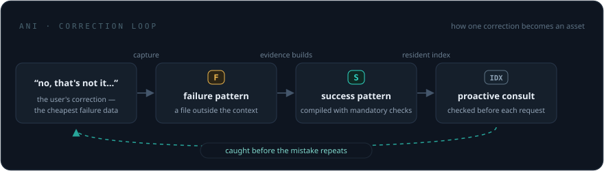
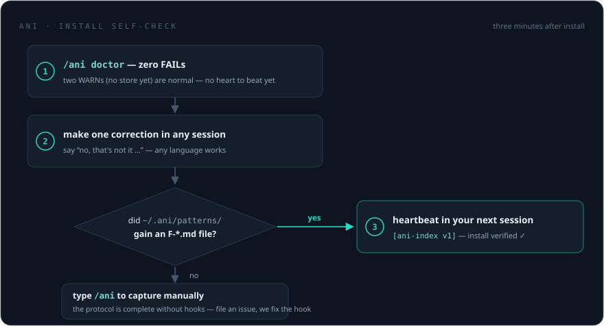
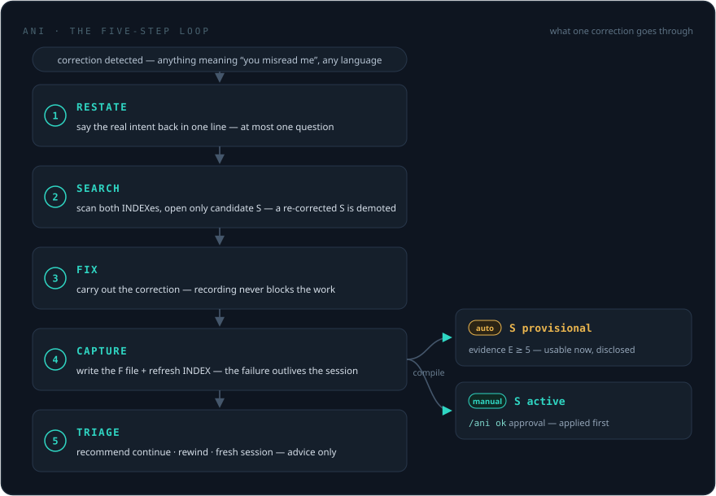

# ani — Agent Negative Index

English · **[한국어](README.md)**

**the no-that's-not-it protocol · a resolution loop for negative feedback**

`ani` carries a double meaning:

- **Agent Negative Index** — an index of your agent's negatives: every "no, that's not it" moment,
  captured, compiled into verified patterns, consulted before the mistake can repeat. As in
  negative indexing — `history[-1]` — it reads backward from the last failure to move forward.
- Korean **아니** ("no"), from **"아니 그게 아니라…"** ("no, that's not it…") — the sentence
  every developer eventually says to their coding agent.

ani is a file-based, agent-agnostic protocol that takes that moment seriously: it captures the
correction, compiles it into a verified success pattern, and makes the context that produced the
failure safe to throw away. If it can read and write files, it can speak ani.

## Contents

- [The idea in 30 seconds](#the-idea-in-30-seconds)
- [Install](#install)
- [What gets written](#what-gets-written)
- [How it works](#how-it-works)
- [Connect your wiki (optional)](#connect-your-wiki-optional)
- [Design](#design)
- [FAQ](#faq)
- [Privacy](#privacy)
- [Status](#status)
- [한국어 소개](#한국어-소개)

---

## The idea in 30 seconds

A correction is the most valuable signal an agent receives: **the misread intent, the real intent,
and the fix**, handed over in one utterance at the moment of failure — a bug report from the only
person who knows what "correct" meant.

Every agent throws it away. The session ends, the transcript scrolls off, the next session repeats
the mistake. No context window fixes that, because nothing was written down.

ani does three things about it:

1. **Captures** it as a failure pattern `F` — intent, misreading, correction, and a verbatim
   excerpt, in a file, outside the context window.
2. **Compiles** `F` into a success pattern `S` carrying mandatory verification, under a trust
   ladder: evidence auto-compiles to a *provisional* rung usable immediately, a human stamp
   raises it to *active*. The human is an auditor, not a gatekeeper.
3. **Frees the context.** The failure now lives outside the session, so ani recommends a rewind
   or a reset instead of grinding on a polluted one.

In one picture:



---

## Install

Three verified paths:

### 1. Claude Code plugin (primary)

```
/plugin marketplace add ThingsLikeClaude/ani
/plugin install ani
```

Skill and hook activate together. As a plugin the skill is namespaced
`plugin-name:skill-name`, so the command you type is `/ani:ani` (`/ani:ani ok F-…`, `/ani:ani
bootstrap`); a manual skill-directory install keeps plain `/ani`. **This document writes `/ani`
throughout, the protocol's short form.**

### 2. Copy the skill

Copy `skills/ani/` into your agent's skills directory. Tier 0 is pure markdown and complete on its
own; the only thing you give up is the deterministic hook, which
[`adapters/claude-code.md`](skills/ani/references/adapters/claude-code.md) covers separately.

### 3. Paste the AGENTS.md snippet

For agents with no skill system, paste the block from
[`adapters/agents-md.md`](skills/ani/references/adapters/agents-md.md) into `AGENTS.md`; for
anything else, see [`generic.md`](skills/ani/references/adapters/generic.md). Adapters land one
verified harness at a time — [contributions welcome](CONTRIBUTING.md).

**Day one is not an empty store.** `/ani bootstrap [--days N]` mines your Claude Code transcripts
for past corrections, clusters them, scores them in hindsight, and lets you approve candidates in
one batch ([`adapters/bootstrap.md`](skills/ani/references/adapters/bootstrap.md)).

### Then run `/ani doctor` until everything is green

Whichever path you took, this is the last install step — not an optional one:

```
/ani doctor
```

It checks your Python, resolves both stores and probes that they are actually writable, parses
each `INDEX.md`, validates any knowledge sources, and looks for the hook registration. One
`OK` / `WARN` / `FAIL` line per check; exit `0` clean, `1` warnings, `2` failures. Keep fixing and
re-running until nothing but `OK` comes back — that, rather than a feeling, is what "installed"
means here.

The one thing it *cannot* check is whether the hooks actually fire, because that happens outside
its process. It says so, and points you at the real test: open a fresh session and look for an
`[ani-index v1]` block.

**If the hooks are not firing, nothing is lost.** `[ani-index v1]` is the heartbeat. When a
session never shows one, ani switches to **manual mode**: it reads the `INDEX.md` files itself,
runs the same five steps, and tells you once so you can run `/ani doctor`. If no Python
interpreter is on `PATH` at all, the session-start hook says exactly that in one line instead of
dying quietly. You lose the deterministic assist, never the protocol — **hooks are accelerators;
the protocol is the guarantee.**

### "So is it actually working for me?" — a 3-minute self-check

Right after install the store (`~/.ani/`) does not exist yet, so doctor shows two WARNs and a
fresh session shows **no** `[ani-index v1]` — that is normal: the heartbeat starts once there is
a heart to record. Verify by doing, not by feeling:

**On the first capture ani checks once, by itself.** Creating the store is the first moment
Python, the install root and write access are *actually* required rather than assumed, so that
is where the doctor runs — and what it reports is acted on by **where the fault lives**, the
same boundary that governs every write.

- **Inside the store** (absent directory, unwritable path, unparsable `INDEX.md`) — fixed for
  you, and said in one line.
- **Outside the store** (no Python, plugin or hooks not installed) — **nothing is touched.**
  You get the one command to run and why it matters. Your environment stays yours.
- **Whether hooks fire** is not the doctor's to answer, so it is not guessed at. A fresh
  session's `[ani-index v1]` answers that.

The check **never blocks the capture.** A correction that arrived is captured even if every
check fails — in manual mode if it must be. The report goes *beside* the capture, never in
front of it. And it happens once: the store exists after this.



---

## What gets written

Everything ani knows is markdown, in two stores with one identical layout:

```
~/.ani/                           # GLOBAL (default, always there): your own
├── INDEX.md                      #   corrections, following you across repos
├── patterns/                     #   — override the path with global_store
│   ├── F-20260828-a1b2c3d4.md    # failure pattern
│   └── S-dark-mode-tokens.md     # success pattern
└── config.md                     # optional overrides

<project>/.ani/                   # PROJECT (opt-in overlay): repo-local patterns,
                                  #   committed, shared, promoted under PR review
```

Corrections about **this repo's** files and conventions land in the overlay when it
exists; corrections about **how you work** land in the global store, and so does
anything ambiguous — personal knowledge leaking into a team repo is the more
expensive mistake. Both stores are searched, project first.

**`/ani git` is how a pattern crosses that boundary.** It lists the global patterns
that look relevant to this repo — those whose source failure recorded this repo's
slug, plus a separately labelled group matched only on keyword overlap — and
**copies** the ones you name into `<repo>/.ani/`. Copies, so your global original is
untouched; one row at a time, because there is no "approve all"; an id already in the
overlay is skipped and named rather than overwritten. Nothing is committed — that
stays yours ([`adapters/publish.md`](skills/ani/references/adapters/publish.md)).

A real incident: the user asked for a **background** change in dark mode; the agent changed the
**text** color, inside a component instead of the tokens.

**The failure pattern**, `<store>/patterns/F-20260828-a1b2c3d4.md` (abbreviated):

```markdown
---
id: F-20260828-a1b2c3d4
status: compiled
date: 2026-08-28
trigger_quote: "아니 그게 아니라 배경색만 바꾸라고"
keywords: [dark-mode, css, background, tokens]
---

## Intent
Make the dark-mode card surface darker. Only the background; the text was correct.

## Misreading
The agent read "어둡게" (darker) as "dim the content" and edited `color` on `.card`
in `Card.module.css` — wrong property, wrong layer: a component override instead of
the token every surface reads.

## Correction
Reverted that edit; changed `--surface-bg` in `src/styles/tokens.css` under
`[data-theme="dark"]` from `#1e1e1e` to `#141414`.

## Excerpt
> User: 다크모드에서 카드가 너무 밝아. 좀 더 어둡게 해줘.
> Agent: Card.module.css에서 `.card { color: #8b8b8b }` 로 조정했습니다.
> User: 아니 그게 아니라 배경색만 바꾸라고. 글자색은 건드리지 마.
```

`## Excerpt` is required and must stand alone — a reader with no transcript access has to be able
to reconstruct the failure from it.

**The compiled success pattern**, `<store>/patterns/S-dark-mode-tokens.md` (abbreviated):

```markdown
---
id: S-dark-mode-tokens
status: active
compiled_from: [F-20260828-a1b2c3d4]
date_compiled: 2026-08-28
keywords: [dark-mode, css, background, tokens]
scope: project
summary: Use when a request asks to make something lighter/darker in dark mode
---

## Situation
A color change described by brightness ("더 어둡게", "too bright") in a UI themed
through custom properties in `src/styles/tokens.css`.

## Action
1. Restate which **property** is meant — brightness words do not name one.
2. Find the token already driving it (`rg "--surface-" src/styles/tokens.css`) and
   change it in the right theme block. Never patch a component file.

## Verification
- method: `git diff --name-only`
  target: the working tree
  expected: only `src/styles/tokens.css` appears
  evidence: the command output in this turn
  on_failure: revert component-level edits, redo the change on the token

## Counter-examples
- Not for an explicit hex value on a named element — that is a literal instruction.
```

**And the INDEX row** that stays in the agent's context:

| id | status | scope | keywords | summary | updated |
| --- | --- | --- | --- | --- | --- |
| S-dark-mode-tokens | active | project | dark-mode, css, background | Use when a request asks to make something lighter/darker in dark mode | 2026-08-28 |

Frontmatter is the source of truth; `INDEX.md` is a regenerable cache under a 60-row / 6KB budget
per store — and both stores share **one** 6KB injection at session start, so a second tier costs no
extra standing context. That is what keeps the catalog resident and proactive matching free. Field
names are English, values may be in any language. Normative spec:
[`schemas.md`](skills/ani/references/schemas.md).

---

## How it works

Detection is semantic: the loop runs with or without a hook.



F closes as `compiled`, provenance in `compiled_from`.

There is also a proactive path: `INDEX.md` stays in context, so each *new* request is compared
against every pattern summary first. Summaries are in "use when …" form — the principle that makes
an agent pick the right skill. The best correction is the one never made.

### The trust ladder

| Rung | Entered by | Used how | Left by |
| --- | --- | --- | --- |
| **provisional** | automatically, at `E ≥ 5` | at once, below active, disclosed and cited by ID | one counterexample → retired, no review |
| **active** | human approval, or a provisional surviving 2 sessions | applied first, cited by ID | a counterexample → review-needed |
| **review-needed** | a counterexample hit an active pattern | **excluded from search** — a wrong manual must not be re-applied | re-approval, or discard → retired |
| **retired** | demotion or discard | never applied | kept as history |

`F` runs a parallel machine: `captured → compiled`, or `captured → archived`. No dead states.

### The evidence score E

Only these signals count; threshold `T` defaults to 5.

| Signal, observed in-session | Score |
| --- | --- |
| Explicit positive acknowledgement ("that's it", "좋아") | +2 |
| Objective verification passed (the draft check ran) | +2 |
| No re-correction on that topic before session end | +1 |
| The same class of pattern seen again (≥2 times) | +2 |
| Structural lint: every required S field is concrete | gate, not points |
| A re-correction on the same topic | round void |

Silence is not satisfaction and "thanks" may be manners, so behavior outweighs sentiment and
**automation is capped at the provisional rung**. Mixed utterances (*"nice, but change X"*) score
per topic — see the cushion rule in [docs/design.md](docs/design.md).

---

## Connect your wiki (optional)

**Without a wiki, ani is already complete.** You configure nothing, nothing about its behavior
changes, and your correction store *is* your growing knowledge. That is the product, not a
degraded mode.

If you do keep one — Obsidian, a Zettelkasten, a docs folder, a handbook in plain markdown — one
config line connects it:

```markdown
---
knowledge_sources: /home/you/vault/.export/ani-claims.md
---
```

That path points at a table in the same six columns as `INDEX.md`, one row per **claim**, written
by whatever your wiki can script:

| id | status | scope | keywords | summary | updated |
| --- | --- | --- | --- | --- | --- |
| K-0010 | active | zettel | postgres, index, composite | Composite index column order follows selectivity — see note 0010 | 2026-08-14 |

A claim is a **pointer, not a copy**. The keywords let the agent recognise the situation; the
summary sends it to *your* note, so it works from the conclusion you already reached instead of
re-deriving half of it from raw transcripts. Same architecture as the store itself — a compiled
index, deterministic matching, a budgeted hint, the body pulled only when needed — one layer out.

The rules are deliberately small. A row needs a `K-…` id and `active` status or it is dropped
silently; a source file is read up to 16 KiB; at most 4 sources, and at most 3 hinted ids per
prompt, with claims filling only the slots patterns did not take. **A claim never outranks a
verified pattern**, and matching happens only when you type a prompt — never at session start —
so a wiki you never mention costs nothing. Export contract, id mapping, and a worked example:
[`adapters/knowledge-source.md`](skills/ani/references/adapters/knowledge-source.md).

---

## Design

Eight pillars, in full in **[docs/design.md](docs/design.md)**:

- **P1–P2** — corrections are bug reports, but a pile of logs is search noise, so `F` must be
  *compiled* into `S`. The human is an auditor, not a gatekeeper: evidence unlocks use, approval
  raises trust.
- **P3** — verification is first-class: `method / target / expected / evidence / on_failure`,
  evidence being fresh tool output from this turn.
- **P4–P5** — files are the protocol, the model is the matcher: no regex core, no embeddings.
- **P6–P8** — Tier 0 needs no adapters; knowledge lives in two tiers, personal knowledge
  following you and team knowledge travelling with the repo (a project-only default would
  fragment your recurring corrections across repos, an overlay makes learning an object of
  code review); and capture makes context disposable.

It also answers "who verifies the verifier", in four layers.

---

## FAQ

**Why no embeddings, no vector database?**
The store is files so any agent — or human — can participate without a runtime, and the matcher is
the model, already better at "is this like that past failure?" than cosine similarity over chunks.
The INDEX fits in context by design, so retrieval is a read, not infrastructure.

**Doesn't it automatically learn wrong things?**
It can propose wrong things; it cannot silently keep them. Automation is capped at provisional,
every application of one is disclosed and cited so you can veto it on sight, and a single
counterexample retires it. A wrong pattern's failure surfaces as your next correction — the thing
ani detects.

**Does it work outside English?**
Detection fires on the meaning of "you misunderstood me" in any language; `triggers.md` carries
per-language hints (ko/en/ja/zh/…) and `config.md` adds your own.

---

## Privacy

**No network calls, ever — ani reads and writes local files, nothing else.** No telemetry, no
account, no phone-home: `bootstrap` mines session logs on your own disk.

---

## Status

v0.1.0 — early. Protocol: [`SKILL.md`](skills/ani/SKILL.md) · schema:
[`schemas.md`](skills/ani/references/schemas.md) · theory: [design.md](docs/design.md) · releases:
[CHANGELOG.md](CHANGELOG.md). Issues and adapter contributions welcome — see
[CONTRIBUTING.md](CONTRIBUTING.md).

MIT licensed.

---

## 한국어 소개

**ani**는 한국어 *아니*에서 왔다. "아니 그게 아니라…" — 코딩 에이전트를 쓰는 사람이라면 누구나
하게 되는 그 말이다.

교정은 에이전트가 받을 수 있는 가장 값진 신호다. 오해된 의도, 진짜 의도, 고치는 방법이 실패의
현장에서 정답과 함께 배달된다. 그런데 모든 에이전트는 세션이 끝나면 이걸 버린다. 반복 교정
피로의 원인은 컨텍스트 크기가 아니라 아무것도 기록되지 않는다는 사실이다.

ani는 이 순간을 실패패턴 `F` 파일로 기록하고, 검증 조건이 필수인 성공패턴 `S`로 컴파일한다.
증거 점수가 임계값에 닿으면 **잠정(provisional)** 등급으로 자동 컴파일되어 즉시 쓸 수 있고,
승인은 사용을 여는 열쇠가 아니라 신뢰 등급을 올리는 도장이다 — 사람은 게이트키퍼가 아니라
감사자다. 반례가 한 번 나오면 잠정 패턴은 심의 없이 퇴역한다.

지식은 두 층으로 산다. 기본 저장소는 사용자를 따라다니는 전역 `~/.ani`이고, repo 루트의 `.ani/`는
팀과 공유하는 옵트인 오버레이다 — 프로젝트만 기본으로 삼으면 같은 교정이 repo마다 조각나고,
오버레이가 있으면 학습이 코드 리뷰의 대상이 된다.

실패가 컨텍스트 **밖에** 기록됐으므로 오염된 컨텍스트는 버려도 되는 소모품이다. 새 세션은 F 파일
하나만 읽고 깨끗하게 재출발한다.
